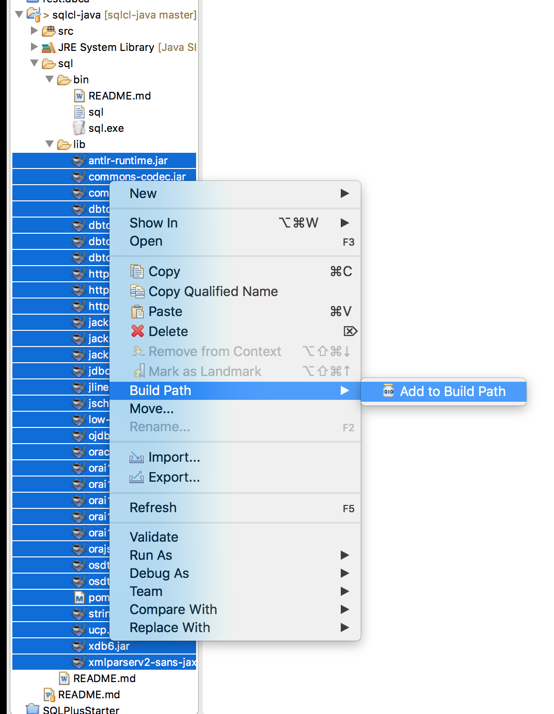

# sqlcl-java

This repository is a few examples of how to use [Oracle SQLcl](http://www.oracle.com/technetwork/developer-tools/sqlcl/overview/index.html) as a Java library.

# Env / Eclipse Setup

1. Download SQLcl
2. Unzip SQLcl
3. Add sql/lib/* files to the classpath

# 

# Examples

## Run Entire script
This example uses the @myfile 'normal' sqlcl / sqlplus syntax to run and entire script. 

[RunMyScript](src/main/java/com/kph/demo2/RunMyScript.java)

## ParseScript and Execute
This is an example of parsing a file with the SQLcl script parser. Then iterating over the array of commands to execute and detect errors to be handled.

[ParseScriptRunOneAtATime.java](src/main/java/com/kph/demo1/ParseScriptRunOneAtATime.java)

> Only 0 rows currently supported in a script resultsno rows selected
> 
> Table KLRICE_TEST created.
> 
> 
> 1 row inserted.
> 
> 
> 1 row inserted.
> 
> 
> 1 row inserted.
> 
> Only 0 rows currently supported in a script resultsno rows selected
> 
> Rollback complete.
> 
> no rows selected
> 
> Table KLRICE_TEST dropped.

$HOME or %HOMEPATH%

Use Intellij to conver this Java Application to a Maven application

1. need to copy and create sqlcl libraries/dependency into local maven repository
     - find the sqlcl libraries -C:\WinApp\Oracle\sqlcl\lib\*
	   such as dbtools-common.jar, dbtools-http.jar, dbtools-sqlcl.jar
	 - install dependency locally:
	 
		cd C:\WinApp\Oracle\sqlcl\lib
		mvn install:install-file -DgroupId=com.oracle -DartifactId=dbtools-common -Dversion=<version> -Dpackaging=jar -Dfile=dbtools-common.jar
		mvn install:install-file -DgroupId=com.oracle -DartifactId=dbtools-http   -Dversion=<version> -Dpackaging=jar -Dfile=dbtools-http.jar
		mvn install:install-file -DgroupId=com.oracle -DartifactId=dbtools-sqlcl  -Dversion=<version> -Dpackaging=jar -Dfile=dbtools-sqlcl.jar

2. update pom.xml to have the created new maven dependency